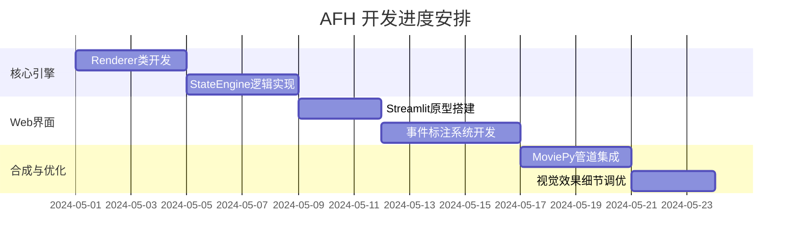

# AFH (AI-Fight-HUD) 项目开发计划书

**项目目标**：利用 Python 自动化脚本和 Web 交互界面，为 AI 生成的格斗视频后期叠加精准、可控、具有《街头霸王6》风格的血条与驱动槽系统。

---

## 一、 技术协议栈 (Tech Stack)

| 维度 | 技术选型 | 说明 |
| --- | --- | --- |
| **开发语言** | Python 3.9+ | 核心逻辑与视频处理 |
| **前端交互** | Streamlit | 快速构建 Web GUI，支持视频逐帧标注 |
| **视频处理** | MoviePy | 视频流读写、帧提取、音画同步 |
| **图像渲染** | Pillow (PIL) | 高级 UI 绘制（渐变、半透明、切角矩形） |
| **数学计算** | NumPy | 用于 Lerp 缓动算法及抖动矩阵运算 |
| **数据交换** | JSON | 存储受击事件轴与 UI 样式配置 |

---

## 二、 核心算法方案

### 1. 双血量逻辑模型

* **Target HP ($HP_t$)**: 逻辑值。事件触发瞬间跳变。
* **Display HP ($HP_d$)**: 视觉值。执行以下算法：
* 若 $t < t_{hit} + delay$，则 $HP_d$ 保持不变（受击顿挫感）。
* 若 $t > t_{hit} + delay$，则 $HP_d$ 以指数级向 $HP_t$ 靠近：$HP_d = HP_d \times (1 - \text{decay}) + HP_t \times \text{decay}$。


### 2. UI 渲染层级 (Bottom to Top)

1. **背景层**：20% 透明度的深灰色倾斜平行四边形。
2. **红槽层**：代表损失缓冲，使用 `(200, 50, 50)` 填充。
3. **主血层**：SF6 经典亮黄 `(240, 200, 30)`。
4. **装饰层**：绘制 6 格绿色 Drive Gauge 小块及角色 ID 文本。

---

## 三、 阶段性里程碑 (Milestones)

### 第一阶段：核心渲染模块 (Foundation)

* [ ] 实现 `SF6Renderer` 类：支持带偏角（Skew）的血条绘制。
* [ ] 实现非对称布局：P1 左对齐，P2 右对齐。
* [ ] **验收测试**：通过单张视频截图渲染出静态血条 UI。

### 第二阶段：状态引擎与动画 (Logic)

* [ ] 实现 `FightStateEngine`：支持 JSON 事件流解析。
* [ ] 实现缓动算法：红槽延迟缩减、受击瞬间血条抖动。
* [ ] **验收测试**：渲染 5 秒黑白对比视频，验证血条缩减的平滑度。

### 第三阶段：Web GUI 标注工具 (Interaction)

* [ ] 基于 Streamlit 搭建视频播放器。
* [ ] 实现“热键标注”功能：播放视频时按 `Space` 或按钮记录 `timestamp`。
* [ ] 实现实时预览：拖动进度条，实时显示当前帧的 UI 叠加效果。
* [ ] **验收测试**：成功在网页端生成一份包含所有受击点的 `match_data.json`。

### 第四阶段：自动化流水线 (Production)

* [ ] 集成 `MoviePy` 多进程渲染，优化合成速度。
* [ ] 支持批量处理模式。
* [ ] **验收测试**：输入 AI 视频，产出带有完整 SF6 风格 UI 的高清对决视频。

---

## 四、 开发计划表 (Timeline)



---

## 五、 项目结构建议

```text
AFH_Project/
├── app.py              # Streamlit Web 入口
├── core/
│   ├── renderer.py     # 负责画图 (Pillow)
│   ├── engine.py       # 负责逻辑计算 (State Machine)
│   └── processor.py    # 负责视频合成 (MoviePy)
├── assets/
│   ├── fonts/          # 格斗风格字体
│   └── icons/          # 头像、装饰素材
├── data/
│   └── match_data.json # 存储标注的事件
└── output/             # 渲染完成的视频

```

---
